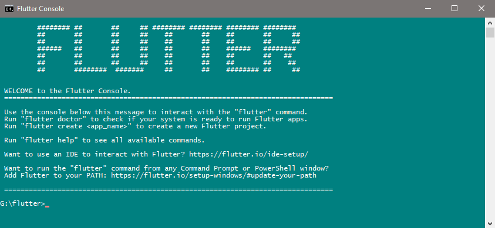

Flutter is Google Mobile UI (User Interface) Framework and Using Flutter can we create a Native apps

What is Native Apps?

A **native app** is a software program that is developed for use on a particular platform or device. … **Native apps** can provide optimized performance and take advantage of the latest technology, such as a GPS, compared to web **apps** or mobile cloud **apps** developed to be generic across multiple systems

How to Install Flutter to Your Window pc

-   download the flutter installation bundle follow below link

**Windows — **[**https://flutter.dev/docs/get-started/install/windows**](https://flutter.dev/docs/get-started/install/windows)

-   Extract the zip file and place the contained `flutter` in the desired installation location for the Flutter SDK (eg. `C:\src\flutter`; do not install Flutter in a directory like `C:\Program Files\`
-   Locate the file `flutter_console.bat` inside the `flutter` directory. Start it by double-clicking

### **Now you are ready to run flutter commands in the flutter console**

