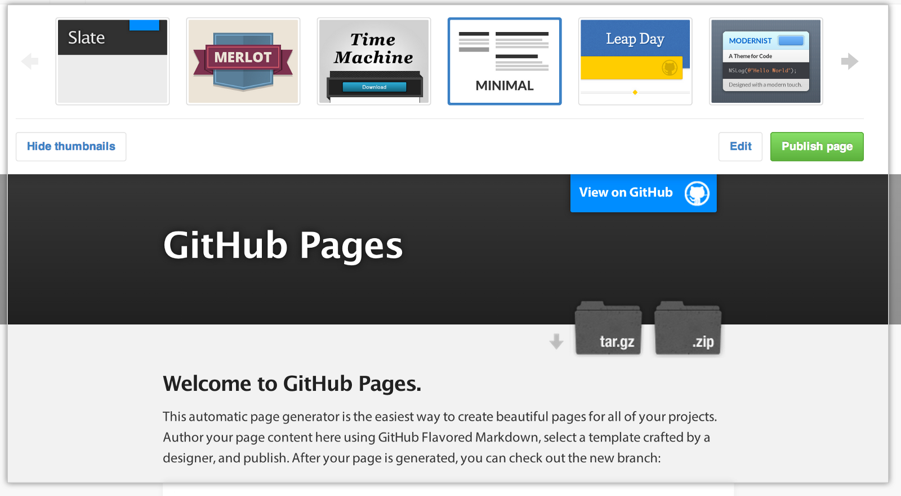
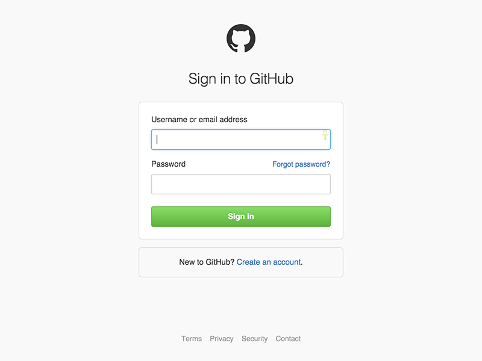
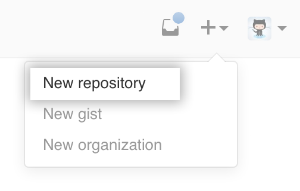
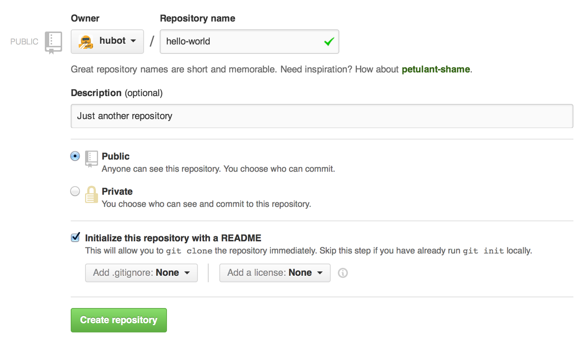
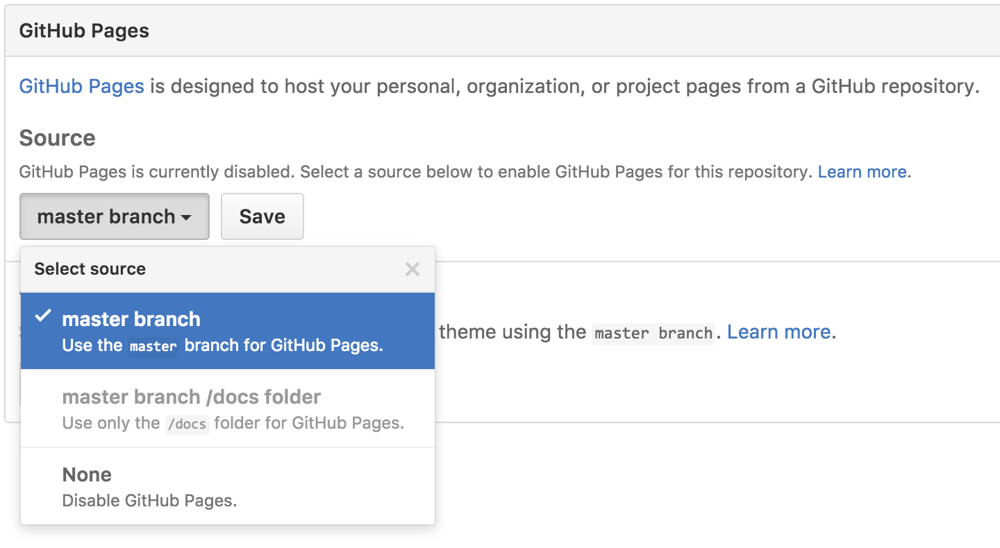

**What is Github page**

_GitHub Pages_ are public web pages for users, organizations, and repositories, that are freely hosted on GitHub’s github.io domain

1.  First you log into your Github account

Once you’ve [signed in](https://github.com/login), you’ll create a new repository to get started and you need to give this repository a special name to generate your website.

### Now open your git bash terminal.

Next go to the folder where you want to store your project, and clone the new repository this command

> **git clone** [**https://github.com/_username_/_username_.github.io**](https://github.com/username/username.github.io)

### Now create the index.html file in folder use this command

> **cd _username_.github.io**

> **echo “Hello World” > index.html**

### And Push it

> git add — all

> git commit -m “Initial commit”

> git push -u origin master

Now go to the your repo settings tab and scroll down you’ll see the **GitHub Pages** section near the bottom and select the master brance and save it

### Now your Done!

**Fire up a browser and go to** [**https://_username_.github.io/repositoryname**](https://username.github.io)
