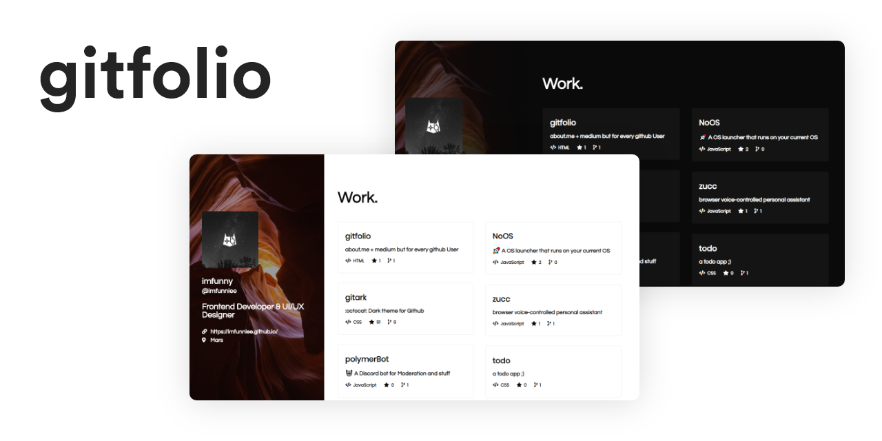

Gitfolio will help you get started with a portfolio website where you could showcase your work



### Getting Started

### Let’s build

a. Clone this repository using `git clone https://github.com/imfunniee/gitfolio.git` or just simply download it.

```
$ git clone https://github.com/imfunniee/gitfolio.git
```

b. Now `cd` into the repository you just cloned `cd gitfolio` and run the below command

```
$ npm i
```

This will install all the dependencies you will need to build your website.

c. After its done installing the dependencies run this command where `username` is your username on github

```
$ node build --name username
```

This will create `index.css` and `index.html` files in your working directory.

d. Congrats, you just made yourself a personal website.

e. To run your website navigate to `index.html` in your browser. \[you won't see blogs until you are on localhost\]

> _if you get stuck somewhere or get an error, please create an issue_

### Let’s customize

#### Enabling Dark theme

To enable dark theme just provide `--dark` as an argument while building

```
$ node build --name username --dark
```

#### Customize background image

To customize the background image just provide `--background [url]` argument while building

```
$ node build --name username --background https://images.unsplash.com/photo-1557277770-baf0ca74f908?w=1634
```

You could also add in your custom CSS inside `index.css` to give it a more personal feel.

### Let’s Publish

Push the files to github. You can host your website using github pages by naming your repo `username.github.io`. You can also your custom domain.

### Updating

To update your info, simply run

```
$ node update
```

This will update your info and your repository info.

To Update background or theme you need to run `build` command again.

### **hurray! — — — — — — — — — — — -**

](./asset-2.png)
